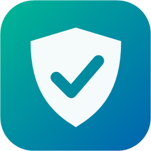
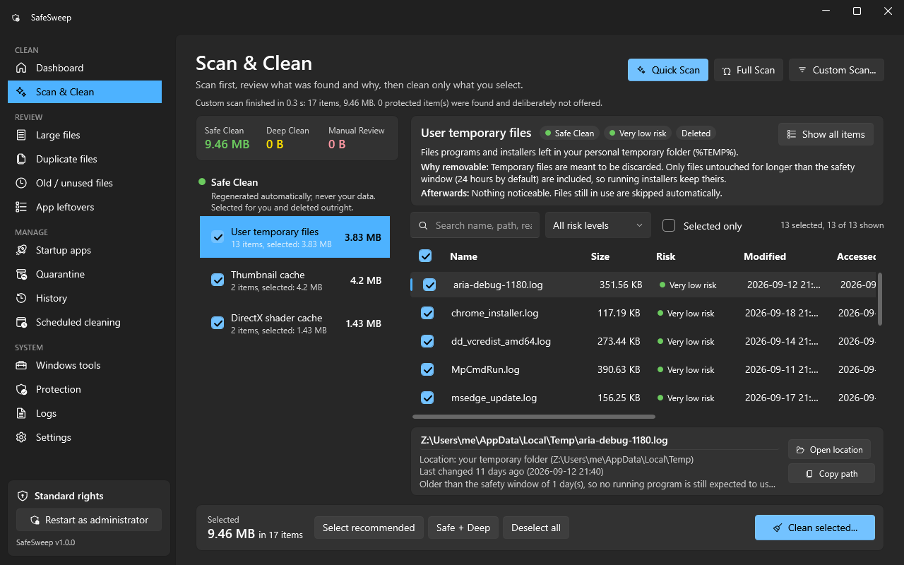
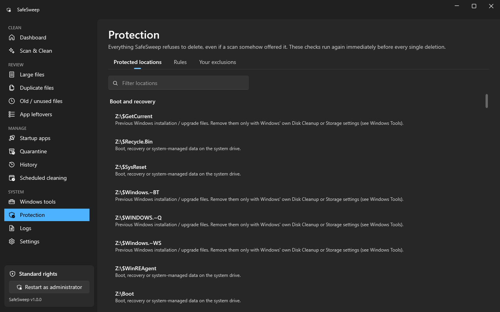

<p align="center">
  
</p>

<h1 align="center">SafeSweep</h1>

<p align="center">
  SafeSweep is an open-source Windows storage cleaner designed around safety, transparency, and user control.
</p>

<p align="center">
  <a href="https://github.com/trxxst/SafeSweep/releases/latest"></a>
  <a href="https://github.com/trxxst/SafeSweep/actions/workflows/build.yml"></a>
  <a href="LICENSE"></a>
  
</p>

<p align="center">
  
</p>

Most cleaners are judged by how many gigabytes they free. SafeSweep is judged by what it
does **not** delete. It explains every item it finds (where it is, how big and how old it
is, why it is considered removable and what happens after it is gone), cleans only what you
select, and checks every single path against its protection rules again right before
touching it. Anything it is not sure about goes to a Manual Review list and is quarantined,
so it can be restored.

## Features

- **Three cleaning levels.** *Safe Clean* (caches and temporary files Windows and apps
  recreate on their own), *Deep Clean* (logs, update caches, crash dumps: never
  pre-selected, quarantined first) and *Manual Review* (your decision, never deleted
  outright).
- **Quick, Full and Custom scans** with a searchable, sortable result list, a select-all
  header that understands partial selections, and an evidence panel for every item.
- **Review tools:** large files, byte-for-byte duplicate files (SHA-256 verified, one copy
  of every group is always kept), old and unused files, leftovers of uninstalled apps, and
  empty folders.
- **Quarantine and restore.** Deep and Review items are moved to a quarantine first and can
  be restored to their original location. Old quarantine items are purged after 30 days
  (adjustable).
- **Startup apps** can be enabled or disabled with the same switch Task Manager uses.
  Nothing is deleted.
- **Scheduled cleaning** of Safe categories through Windows Task Scheduler.
- **History and logs** of every clean, restore, purge and refusal, including everything that
  was skipped and why.
- **Simulation mode** that shows what a clean would do without touching anything.
- **Administrator rights only when needed.** SafeSweep starts with normal rights; system
  locations offer a *Restart as administrator* button.
- Light and dark theme, keyboard navigation, and a layout tested at 1366x768, 1920x1080
  and 2560x1440 with 100%, 125% and 150% display scaling.

## Safety first

SafeSweep is built on the assumption that a wrong deletion is far worse than a missed one.

- **Default deny.** Automatic cleaning is limited to a fixed list of known cache and
  temporary locations. Everything else is out of bounds unless you pick it yourself in a
  review tool.
- **Protected locations are never touched:** Windows system folders, Program Files, the
  install folder of every installed program, drivers, boot and recovery data, the registry,
  credentials and certificates, browser passwords, cookies, history and bookmarks, wallets
  and key stores, version-control folders, game libraries, other users' profiles, cloud
  sync folders (OneDrive, Dropbox, Google Drive, iCloud) and SafeSweep's own files.
- **Your personal folders** (Documents, Desktop, Pictures, Downloads and so on) are never
  cleaned automatically.
- **Links cannot trick it.** Junctions, symbolic links, hard-linked files and paths that
  resolve somewhere else are detected and refused. `..` segments, short 8.3 names, mixed
  case and trailing dots are normalised before any check.
- **Checked twice.** Every path is checked when the scan runs and again immediately before
  it is deleted. A file that changed since the scan, or a program that started using it,
  is skipped.
- **Nothing is selected for you** outside Safe Clean, and review items are always
  quarantined or sent to the Recycle Bin, never deleted outright.
- **Partial failures are reported honestly.** Files in use, missing files and permission
  errors are listed per item after every clean.

The full design is in [docs/SAFETY.md](docs/SAFETY.md). If you find a way to make SafeSweep
delete something it should not, please report it privately as described in
[SECURITY.md](SECURITY.md).

<p align="center">
  
</p>

## Download

Get the latest version from the **[Releases page](https://github.com/trxxst/SafeSweep/releases/latest)**.

| File | Who it is for |
| --- | --- |
| `SafeSweep-Setup-x64.exe` | **Most people.** Installs SafeSweep for all users, adds a Start menu entry and an uninstaller. |
| `SafeSweep-Portable-x64.exe` | Runs without installing. Keep it in any folder you like. |
| `SafeSweep-x64.msi` | IT administrators who deploy with Group Policy, Intune or similar tools. |
| `SHA256SUMS.txt` | Checksums to verify your download. |

All builds are self-contained: you do not need to install .NET.

### Windows SmartScreen

SafeSweep releases are not code-signed yet (signing certificates cost money, and this is a
free project). The first time you run the download, Windows SmartScreen may show
*"Windows protected your PC"*. To continue, click **More info**, check that the file name
is the one you downloaded from this repository, then click **Run anyway**.

You can verify that your file matches the published build before running it:

```powershell
Get-FileHash .\SafeSweep-Setup-x64.exe -Algorithm SHA256
```

Compare the result with the line for that file in `SHA256SUMS.txt` on the release page.
If they differ, do not run the file.

## Installation

**Installer:** run `SafeSweep-Setup-x64.exe` and follow the steps. SafeSweep is installed to
`C:\Program Files\SafeSweep` and appears in the Start menu. Uninstall it from
*Settings > Apps > Installed apps*. Uninstalling removes the program and its scheduled clean
(if you created one), but deliberately keeps `%LOCALAPPDATA%\SafeSweep`, because the
quarantine inside it may still hold your files. Delete that folder yourself when you no
longer need anything in it.

**Portable:** put `SafeSweep-Portable-x64.exe` anywhere and run it. Settings, history,
logs and the quarantine are stored in `%LOCALAPPDATA%\SafeSweep`.

**Requirements:** Windows 10 or Windows 11, 64-bit.

## Using SafeSweep

1. Click **Quick Scan**. It looks only at Safe Clean categories and takes a few seconds.
2. Read through the results. Select an item to see where it is and why it can be removed.
3. Click **Clean selected...**, review the summary and confirm.
4. Use **Full Scan** or the review tools when you want to look at bigger things. Nothing
   there is selected for you.
5. Changed your mind? Open **Quarantine** and restore what you need.

## Building from source

Requirements: Windows 10 or 11 (x64), the [.NET 9 SDK](https://dotnet.microsoft.com/download/dotnet/9.0)
and Git. Visual Studio 2022 (17.12 or later) or JetBrains Rider are optional.

```powershell
git clone https://github.com/trxxst/SafeSweep.git
cd SafeSweep
dotnet build SafeSweep.sln -c Release
dotnet run --project src/SafeSweep.App -c Release
```

To produce the release files (installer, MSI, portable exe and checksums) exactly as the
GitHub Actions workflow does:

```powershell
powershell -ExecutionPolicy Bypass -File .\scripts\build-release.ps1
```

The script restores packages, checks formatting, builds with warnings treated as errors,
runs the tests, publishes the app and builds the installer with the WiX Toolset (fetched
from NuGet automatically). The results are written to `dist\`.

## Development

```powershell
dotnet test SafeSweep.sln                                  # all tests
dotnet test SafeSweep.sln --filter "Category!=Integration" # sandbox only, as in the release script
dotnet format whitespace SafeSweep.sln                     # fix formatting
```

- Tests that delete anything do so only inside a throw-away folder tree that mimics a
  Windows installation (`tests/SafeSweep.Tests/Sandbox.cs`), including real junctions and
  hard links.
- `Category=Integration` tests run a **read-only** full scan of the machine they run on and
  assert that nothing offered lies in a protected location.
- `Category=UI` tests open the real window at every supported size and scaling factor and
  check that nothing is cut off and every main button stays reachable.

Project layout:

```
src/SafeSweep.Core      scanning, protection and cleaning engine (no UI)
  Safety/               PathUtil, SystemPaths, ProtectionPolicy, PathGuard
  Rules/                every built-in cleanup category
  Scanning/ Cleaning/   scanners, CleanEngine, QuarantineStore
src/SafeSweep.App       WPF user interface (MVVM, CommunityToolkit.Mvvm, WPF-UI)
tests/SafeSweep.Tests   xUnit tests
installer/              WiX projects for the MSI and the setup program
scripts/                release build script
```

## Safety architecture

In short: scanners *propose*, the protection layer *decides*, and the clean engine
*re-checks*. No code in SafeSweep can delete a file without going through `PathGuard`.

1. Every candidate path is normalised (full path, `..` removed, 8.3 names expanded, case
   and trailing dots handled) before it is compared with anything.
2. `ProtectionPolicy` refuses protected locations, protected file names and patterns,
   protected folder names at any depth, browser profile data other than caches, cloud sync
   folders, the folders of installed programs and SafeSweep's own install and data folders.
3. Automatic cleaning is only allowed inside cleanup roots registered at scan time, and a
   root that is a drive, a top-level folder, a profile or a personal folder is refused.
4. Right before deleting, `CleanEngine` checks the item again: it resolves the final path
   through any link, refuses reparse points, hard links, system files and cloud
   placeholders, confirms size and date still match the scan, and skips files a running
   program is using.
5. Only Safe Clean items and empty folders are deleted directly. Everything else is moved
   to the quarantine (or to the Recycle Bin when Windows guarantees to keep it there).

Details, including how application leftovers are detected, are in
[docs/SAFETY.md](docs/SAFETY.md).

## Contributing

Contributions are welcome. Please read [CONTRIBUTING.md](CONTRIBUTING.md) first. Changes
that touch deletion or the protection rules need tests that show both what is now allowed
and what is still refused.

## Reporting bugs

Open an issue with the [bug report template](https://github.com/trxxst/SafeSweep/issues/new/choose).

> **Before you attach logs or screenshots:** SafeSweep's logs
> (`%LOCALAPPDATA%\SafeSweep\Logs`) and its result lists contain full file paths, which
> often include your Windows user name and the names of your files and folders. Remove or
> replace anything private before posting. Never post the contents of your quarantine.

Security problems, including any way to make SafeSweep delete something it should not,
should be reported privately: see [SECURITY.md](SECURITY.md).

## License

SafeSweep is released under the [MIT License](LICENSE). It uses
[WPF-UI](https://github.com/lepoco/wpfui) and the
[.NET Community Toolkit](https://github.com/CommunityToolkit/dotnet), both MIT licensed. See
[THIRD-PARTY-NOTICES.md](THIRD-PARTY-NOTICES.md).
